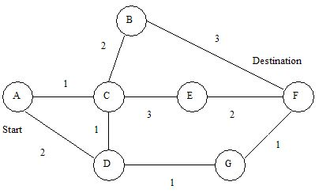
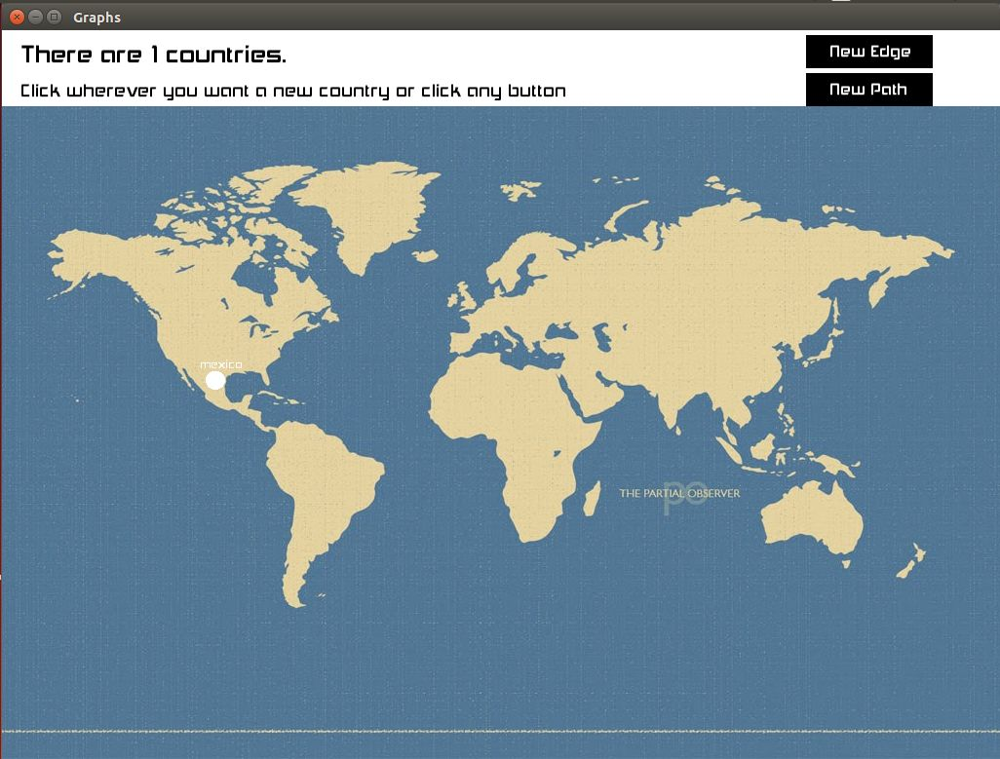
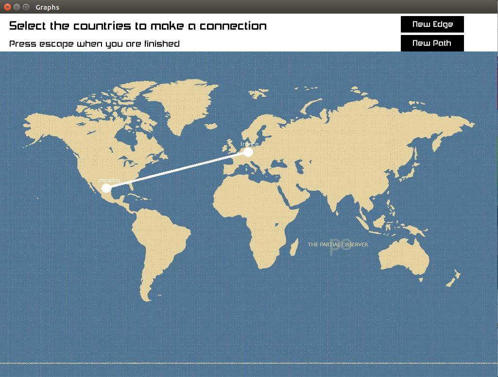
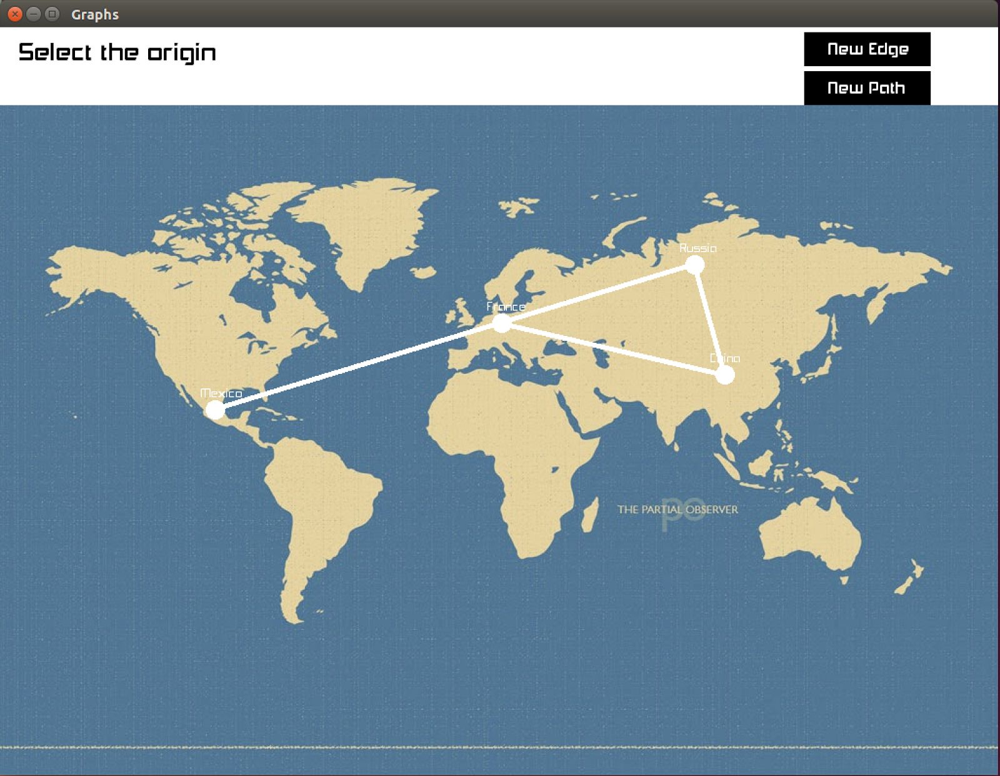
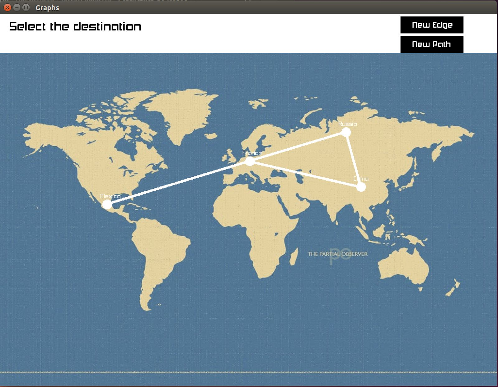
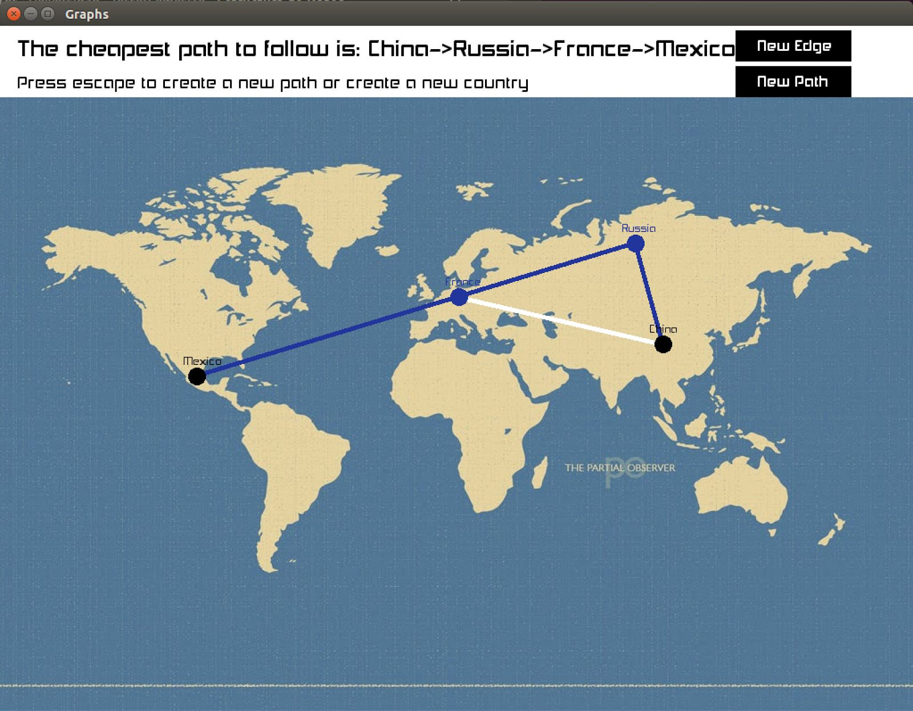

# Documentation : Final Project Data Structures (SFML Graphs)

## Background

### Dijkstra Algorithm


Computer scientist Edsger W. Dijkstra came up with a algorithmic solution to finding
the shortest path between nodes (or vertices) in a graph. This algorithm has been changed
and improved from the original iteration several times considering how it started by analyzing
the shortest path between nodes. Now more popular version, a “source” node is established
at the beginning and a shortest-path-tree is created. This tree basically entails the shortest
paths from the previously established source node to the rest of her nodes in the graph. If
only a single shortest path is the objective the algorithm may be stopped once the shortest
path to the node is found, eliminating the need for more path analysis. The algorithm brings
a high level of importance to the practice and use of graphs since many of today's current
information systems rely heavily on the relationship built on weighted or unweighted graphs
to give values to this connections or edges. For example the cost between the nodes could
represent the distance between two geographical points or places in reality. Besides this
common use, it is also been utilized for network routing protocols and integrated as a
subroutine on other algorithms like Johnson's algorithm.
The way Dijkstra’s algorithm works is by assigning one of the nodes as the initial node, then you select another node to which the initial node will be related by a random cost
usually selected as infinity so that the algorithm will try to improve this value by looking for a different path. This tentative value assigned for the nodes is all the same except for the initial
node whose value usually is established as 0. The initial node is named current while all of
the other nodes are marked as “unvisited”. A set is created consisting mainly of these unvisited nodes. The next step would be to calculate the values to reach each one of the neighboring nodes from the initial and depending if these values are smaller than the initially assigned values then you substitute this value, otherwise the current value is kept. After calculating all of the paths from this node, the node is marked as visited and removed from
the set of unvisited nodes so you don't calculate from this node again.



This is the main general description of Dijkstra's algorithm on how it works but with the passing of time many modifications have
been made to improve upon the original iteration, but this procedure doesn't work when weight values between nodes is negative or other problems. But for this project the algorithm

## Resolution of the problem

Our main problem with this assignment was to think and implement a way to let the user interact with the program and display, the resolution of the algorithm and the components of a Graph data structure, graphically using the library SFML for C++. There are
many ways to achieve this, but in our opinion, we chose the best one as the user just
interacts on the SFML window, he does nothing in the console but run the program. We
decided to go with this way because in the others that we thought; if we did not use threads,
the graphical program running in SFML window freezed when asking for an user input in the
console. Or if using threads we did not solve how to pass all the parameters expected from
the menu thread to the viewer’s.
Nevertheless exploring the SFML documentation we saw that the program detects
the keyboard user’s input, when the mouse has been clicked and the position of the it in the
window, so via mostly triggering booleans we can determine which option the user wants
and where does the input (if accepted at that time) must be saved.
A big obstacle that we encountered was to get the clicked vertex so the program
would be fully interactive via SFML. To be able to do this, we defined a function in the graph
class to get the vertices list but we got strange behaviour in our program and nothing that
can be interpretable. So we resolved this by instead of the function returning the list it should
return a pointer to that list. As a result of this we could loop in the list until there is no
elements and in each one we compared its coordinates and size to get its position. Then this
position can be compared with the mouse position in the window, and if they match we
return a pointer to this vertex. If the position of any vertex matches the position of the mouse
we return a null pointer.

## Getting Started

### Prerequisites

In order to run this you will need to have installed the following:

1. [gcc](https://gcc.gnu.org/install/)
2. [SFML](https://www.sfml-dev.org/)

### User Manual

Our program mainly works being launched from a computer terminal but is not bound
to a command line interface, only when compiling and running the program the user must
begin from the computer terminal. 

Assuming the user is from a computer terminal. The first step is to download or clone the repository to the computer. Then, open the terminal and navigate to the project's directory and run:

```
$ make
```

Once the program is successfully compiled and presents no errors the user has to write the command:

```
$ ./graphs
```

Next a SFML window is displayed showing a geographical map of the entire world.
There are two main sections of the window, the actual map where the graphical interface will
show created vertices (countries) and their respective connections or edges. The other part
of the window is the very top of the window which shows the information the program gives
to the user and the inputs from the user defining names for the countries and costs for the
edges. This section also shows the instructions for the user to follow which we will define on
this user manual.

Starting the program prompts the following screen to appear. On this screen we can
see the information described before regarding the two main sections and their use. We can
see that the program informs the user that there are no current countries on the map. The
top section also instructs the user to click anywhere on the map to create a country or
vertex. The far right side shows two buttons labeled “New Edge” and “New Path”, these
buttons help create an edge from two existing countries and calculating the shortest path to
a destination respectively (More on this later).


After selecting a part of the map the top section changes to ask the user to name the
country just created and after pressing the enter key, the window shows the previous state
where the number of countries is specified but it has now changed to 1 country. Also the
map shows graphically the location of the country created by the user.




After the country is created the program lets you keep adding countries repeating the same
process. If there are one or more countries when you create a new one the program will let
you create edges between countries making the new country the origin to the, selected
country with the mouse, destination. Then the program will ask the user write the cost and
when he presses enter the connection is made and the screen should appear as follows:



Or you can relate any
countries already created with an edge by clicking “New Edge” which prompts the selection
of the origin and the destination.


When the user clicks the button “New Path”, to calculate the cheapest path from an
origin to a destination, the program will ask to click the origin:


If the user did click a country (in this example China), then the program will ask to click the
destination:


If the user did click a vertex (in this example Mexico) the program calculates the cheapest
path possible (if exists) with Dijkstra algorithm, and present it to the user as follows:


As it can be seen, the origin and destination countries are displayed in black, while all the
remaining path is displayed in blue. When the user wants to erase the path to make a new
one, create a new country or create a new edge, he has to click the key escape.


